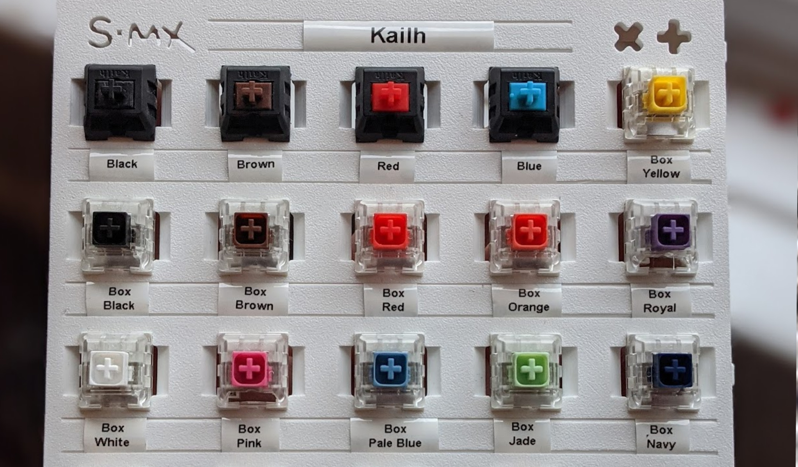
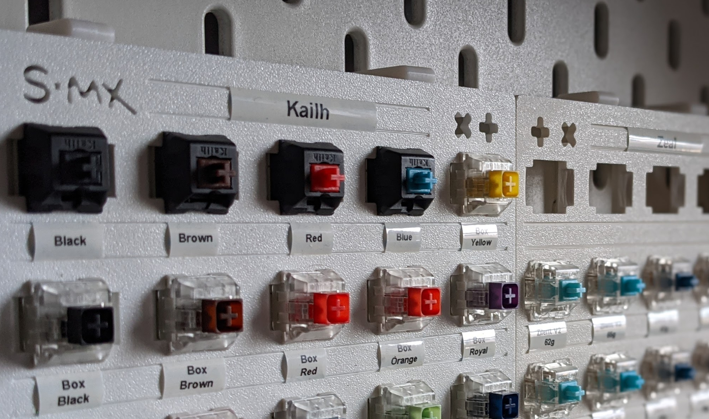
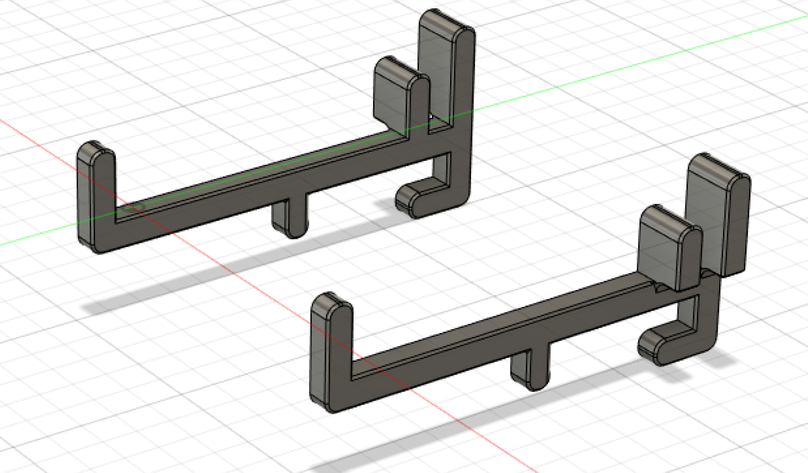
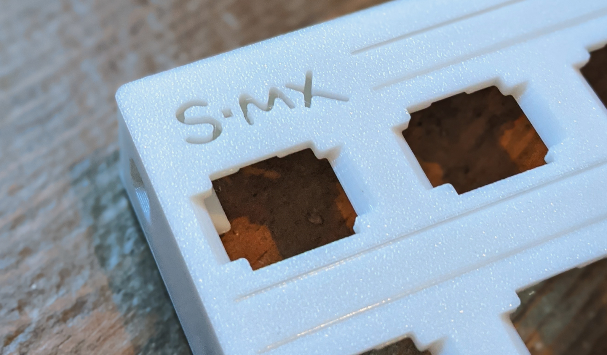
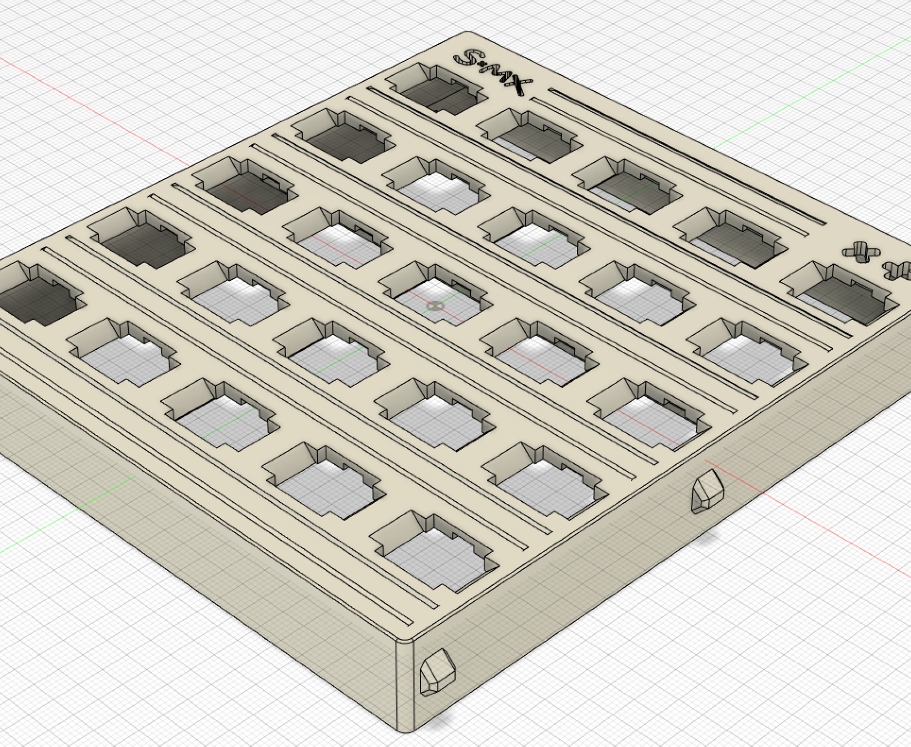

# SMX-HLDR
Mechanical keyboard switch holder, display, and tester.

## Features
- Switch holes with side cutouts to showcase both top and bottom of the switch.
- Holds 25 switches (5*5).
- Stackable (the feet fit snugly on top of mounted switches) and prevent multiple stacks from toppling over.
- Unique label track system - compatible with standard 9mm label makers (for example the Dymo LabelManager 160). Labels simply slot in with no adhesive and are held in firm but can be adjusted with a little force to make them line up perfectly.
- Designed with postage costs in mind (fits inside the constraints of a large letter package)
- Each switch holder fits next to each other nicely with the alignment nubs.
- Spaces on each corner to accomodate 6x2mm 3M self adhesive rubber feet for stability, sound profile and feel.
- Optional IKEA SKÅDIS pegboard compatible clips to allow for wall mounting.

## How to print
Here are the settings I use to get a great looking print:
- **Printer:** Prusa i3 MK3S
- **Print sheet:** Textured steel sheet
- **Print settings:**
  - **Layer height:** 0.20mm
  - **Infill:** 10%
  - **Supports:** No

**Note. Your results may vary due to variations in printer quality.**
I've included the ready-to-print g-code file which is based on the above settings.

## Accessory
Optional [IKEA SKÅDIS](https://www.ikea.com/gb/en/p/skadis-pegboard-combination-white-s09216595/) pegboard clips to allow for wall mounting.

## More photos

## Questions? Contact?

Feel free to message me on [Instagram.com/switches.mx](https://www.instagram.com/switches.mx/) or Discord **BOWLER#2802**

If you find this useful and would like to contribute to keep the lights on at [Switches.mx](https://switches.mx) feel free to [PayPal me](https://paypal.me/switchesmx)
